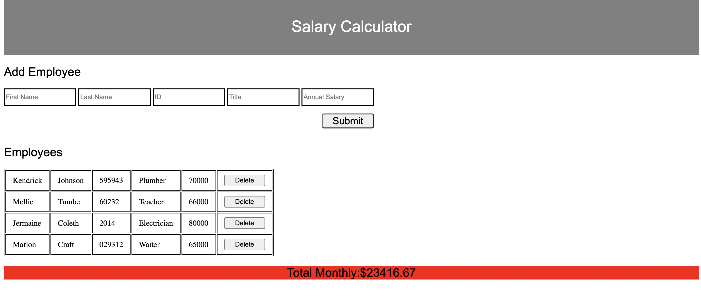

# Salary Calculator

## Description

_Duration: 3 Day Sprint_

This application allows individuals and companies to calculate the monthly costs of employee annual salaries using various inputs. These inputs includes first name, last name, employee ID, job title, and annual salary. There is a $20,000 monthly limit, that once it is reached notifies the user with a red 'Total Monthly' background color(See below).

To see the developer's professional Linkedin page please visit: [HERE](https://www.linkedin.com/in/danielpatha/)

## Screen Shot

### Prerequisites

Link to software that is required to install the app.

- jQuery

## Installation

1. Fork the repository using the button on the top left in Github.

2. Clone the repository to your computer and open it up using a code editor like Visual Studio Code.

## Built With

List technologies and frameworks here
-JavaScript
-HTML
-CSS

## License
[MIT](https://choosealicense.com/licenses/mit/)

_Note, include this only if you have a license file. GitHub will generate one for you if you want!_

## Acknowledgement
Thanks to [Prime Digital Academy](www.primeacademy.io) who equipped and helped me to make this application a reality. (Thank your people)

## Support
If you have suggestions or issues, please email me at [patha037@umn.edu](www.google.com)